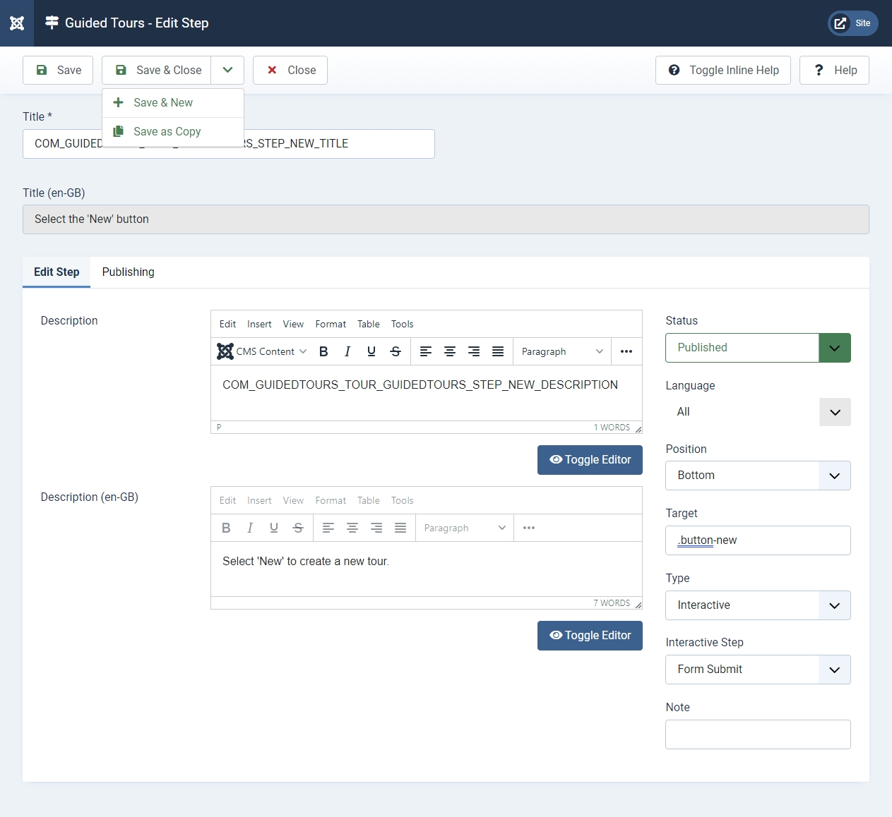

# Steps: Edit

## Description

This screen is used to add a new or edit an existing Step of a tour, usually using a Wysiwyg editor. The default editor is TinyMCE but if other editors are installed the default editor may be set to something else for the site as a whole or for individual users.

## How to Access

**System** -> **Manage** -> **Guided Tours**

Enter a tour's steps screen by selecting the steps number from the Steps column.

To add a Step:

- Click the **New** toolbar button

To edit a Step:

- Select a **Title** from the list

## Screenshot

## Form Fields

- **Title**. The Title for this step. Usually it is a call to action, for example 'Enter a title' if the step demands user interaction. If the title is a language key, an aditional field is shown, representing the translation of that key for the user's locale.

## Edit Step

**Left Panel**

- **Description**. This is where you enter the description of the step, usually a detailed explanation or help for the step. Joomla includes 3 editors, the default **Editor - TinyMCE** is shown here. 
  
  The step description can be a language key. When this is the case, a secondary field presents the translated description of that key for the user's locale.

- The CMS Content dropdown list provides access to **Media**.

- **Toggle Editor**. A Toggle Editor button show below the edit window. This button allows you to toggle between **TinyMCE** and **Editor - None**.

**Right Panel**

- **Status**. The published status of this step.
  
  - **Published**: Step is visible when the tour is run.
  
  - **Unpublished**: Step is not visible when the tour is run.
  
  - **Archived**: Step will no longer show.
  
  - **Trashed**: Step is deleted but still in the database.

- **Language**. Select the language for this step. It takes the language from the tour.

- **Position**. The position of the step relative to the information it points to.
  
  - **Bottom**: Step shows below the target.
  
  - **Center**: Step shows at the center of the screen. When a target is missing, this is
     the default position.
  
  - **Left**: Step shows at the left of the target.
  
  - **Right**: Step shows at the right of the target.
  
  - **Top**: Step shows above the target.

- **Target**. The element of the screen the step points to. It uses CSS syntax. 
  
  For example, '.button-new' will target the button of the page having class 'button-new'. 
  
  If the target is not unique, the first target found is used. When creating interactive steps, make sure the target is focusable for accessibility. You may use several selectors, comma separated. The first valid one will become the target (a selector is valid if: found on the page, not disabled, not read only and not hidden). If a target has been set but it is not found or it is invalid, the tour won't break but show the step at the center of the screen.

- **Type**. The type of step.
  
  - **Next**: The user running the tour will walk through the next step.
  
  - **Redirect**: The step will be redirected to another page.
  
  - **Interactive**: The step requires user interaction, like entering data.

- **URL**. The url to redirect to for a step of type 'Redirect'. 
  
  For example, *administrator/index.php?option=com_users&view=user&layout=edit* will redirect the step to the user edit screen.

- **Interactive Type**. The type of interaction for an interactive step.
  
  - **Form Submit**: The target is a button that submits a form.
  - **Text Field**: The target is an input text field. If the field is required, the person running the tour won't be able to continue to the next step until data is entered.
  - **Button**: The target is a button on the screen.
  - **Other**: The target is any other form element.

- **Note**. This is for the administrator's use (for example, to document information about this step).

## Publishing

**Publishing**

- **Created Date**. The current time when the Step was created. Enter in a different date and time or click on the calendar icon to find the desired date.
- **Created By**. Name of the User who created this Step. This will default to the currently logged-in user. If you want to change this to a different user, click the Select User button.
- **Modified Date**. Date of last modification.
- **Modified By**. Username who performed the last modification.
- **ID**. A unique identification number for this Step, you cannot change this number. When creating a new Step, this field displays "0" until you save the new entry.

## Toolbar

At the top of the page you will see the toolbar shown in the [Screenshot](#screenshot) above.

- **Save**. Saves the step and stays in the current screen.
- **Save & Close**. Saves the step and closes the current screen.
- **Save & New**. Saves the step and keeps the editing screen open and ready to create another step.
- **Save as Copy**. Saves your changes to a copy of the current step. Does not affect the current step.
- **Close**. Closes the current screen and returns to the previous screen without saving any modifications you may have made.
- **Toggle Inline Help**. Show help text below some options.
- **Help**. Opens this help screen.

## Quick Tips

- There are 2 methods to insert an image into the step's description using the TinyMCE editor.
  
  1. The **CMS Content** dropdown list provides access to the **Media** screen that lets you browse image files and upload images.
  
  2. The 'Insert' dropdown list is a simple form for which you need to know the image url. It is used for external images.

- Use **GUIDEDTOUR** in language keys as a convention wherever language
   keys are used (for title and description).
