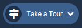
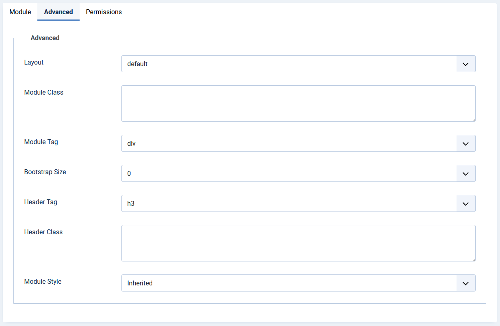
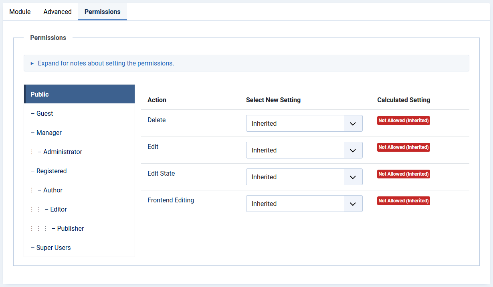

# Administrator Modules: Guided Tours

## Description

The **Guided Tours** module shows a list of available guided tours.

It will present itself as a dropdown, available in the Administrator Title Bar.

## How to Access

Select **System** → **Manage** Panel → **Administrator Modules** from the Administrator menu. Then...

-   To create a new module: select the **New** button from the Toolbar. Then...
    -   Select the required module type.
-   To edit an existing module:
    -   Find the module in the list of installed modules and select the title link in the **Title** column.

## Screenshot

## Form Fields

-   **Title.** The title of the module. This is also the title displayed for the module depending on the *Show Title* Form Field

### Module Tab

**Left Panel**

-   **Tour Count:** The maximum number of tours presented in the dropdown. Those and the remaining tours show in a modal window for easy selection.

**Right Panel**

-   **Show Title**. (Show/Hide) Choose whether to show or hide the modules title. The title will be the one in the Form Field above.

-   **Position.** Choose the [module position](https://help.joomla.org/proxy?keyref=Module_Position/en 'Module Position/en') you wish this module to be displayed in. AN adequate position is _status_.

-   **Status**. The published status of the item.

-   **Access**. The [viewing Access Level](https://help.joomla.org/proxy?keyref=Help4.x:Users:_Viewing_Access_Levels/en 'Help4.x:Users: Viewing Access Levels/en') for this item.

-   **Module Ordering.** This shows a drop down of every module in the position that the current module is in. This is the order that the modules will display in the [Modules](https://help.joomla.org/proxy?keyref=Help4.x:Modules/en 'Help4.x:Modules/en') page.

-   **Start Publishing**. Date and time to start publishing. Use this field if you want to enter content ahead of time and then have it published automatically at a future time.

-   **Finish Publishing**. Date and time to finish publishing. Use this field if you want to have content automatically changed to Unpublished state at a future time (for example, when it is no longer applicable).

-   **Language**. Item language.

-   **Note**. This is normally for the site administrator's use (for example, to document information about this item).

## Advanced Tab

-   **Layout.** If you have defined one or more alternative layouts for a module either in the template or Joomla! Core, you can select the layout to use for this module.
-   **Module Class.** A suffix applied to the CSS class of the Module. This allows you to create customized CSS styles that will apply just to this module. You would then modify the "user.css" file of your template to apply styling to this new class. Enter this parameter with a leading space to create a new CSS class for this module. Enter the parameter without a leading space to change the CSS class name for this module.
-   **Module Tag.** The HTML tag for the module to be placed in. By default this is a div tag but other HTML5 elements can also be used.
-   **Bootstrap Size.** (Values 0 to 12) This allows you to choose the width of the module via the span element built into bootstrap.
-   **Header Tag.** The HTML tag to use for the modules header or title. This can be an h1, h2, h3, h4, h5, h6 or a p tag. Note that you must use a module style (chrome) of html5 or add your custom module styles in `<mytemplate>/html/modules.php`.
-   **Header Class.** Here you can add optional CSS classes to add to the modules header or title element.
-   **Module Style.** You can use this option to override the templates style for its position.

### Permissions Tab

To change the permissions, do the following.

-   Select the **Group** by clicking its title located on right.
-   Find the desired **Action**. Possible Actions are:
    -   **Delete**. Users can delete the module.
    -   **Edit**. Users can edit the module.
    -   **Edit State**. User can change the published state and related information for the module.
-   Select the desired permission for the action you wish to change. Possible settings are:
    -   **_Inherited._** Inherited for users in this Group from the Global Configuration, Article Manager Options, or Category permissions.
    -   **_Allowed._** Allowed for users in this Group. Note that, if this action is Denied at one of the higher levels, the Allowed permission here will not take effect. A Denied setting cannot be overridden.
    -   **_Denied._** Denied for users in this Group.
-   Select **Save** in the **Toolbar**. When the screen refreshes, the Calculated Setting column will show the effective permission for this Group and Action.

## Toolbar

At the top of the page you will see the toolbar shown in the Screenshot above. The functions are:

-   **Save.** Saves the item and stays in the current screen.

-   **Save & Close**. Saves the item and closes the current screen.

-   **Save & New**. Saves the item and keeps the editing screen open and ready to create another item.

-   **Save as Copy**. Saves your changes to a copy of the current item. Does not affect the current item. This toolbar icon is not shown if you are creating a new item.

-   **Close**. Closes the current screen and returns to the previous screen without saving any modifications you may have made.

-   **Help**. Opens this help screen.
