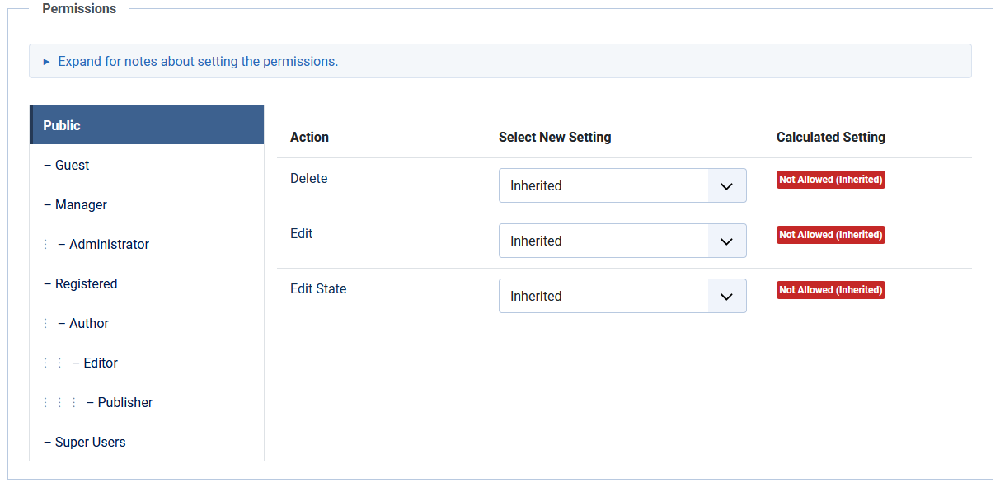

# Tours: Edit

## Description

This screen is used to add a new or edit an existing Tour, usually using a Wysiwyg editor. The default editor is TinyMCE but if other editors are installed the default editor may be set to something else for the site as a whole or for individual users.

A tour must include a least one step. Once a tour has been newly created, go to the tours list and select '0' from the Steps column.

## How to Access

**System** -> **Manage** -> **Guided Tours**

To add a Tour:

- Click the **New** toolbar button

To edit a Tour:

- Select a **Title** from the list

## Screenshot

## Form Fields

- **Title**. The Title for this tour. If the title is a language key, an aditional field is shown, representing the translation of that key for the user's locale.

## Edit Tour

**Left Panel**

- **URL**. The mandatory relative path from where the tour starts. 
  
  For instance, to start a tour from the tour's page, enter *administrator/index.php?option=com_guidedtours&view=tours*.

- **Description**. This is where you enter the description of the tour. Joomla includes 3
   editors, the default **Editor - TinyMCE** is shown here. 
  
  The tour description can be a language key. When this is the case, a secondary field presents the translated description of that key for the user's locale.
  
  The CMS Content dropdown list provides access to **Media**.

- **Toggle Editor**. A Toggle Editor button show below the edit window. This button allows you to toggle between **TinyMCE** and **Editor - None**.

**Right Panel**

- **Status**. The published status of this tour.
  
  - **Published**: Tour is visible in the Take a tour dropdown.
  
  - **Unpublished**: Tour is not visible in the Take a tour dropdown.
  
  - **Archived**: Tour will no longer show.
  
  - **Trashed**: Tour is deleted but still in the database.

- **Access**. Select the viewing access level for this tour. The access levels depend on what has been set up in **Users: Access Levels**.

- **Language**. Select the language for this tour. Keep the default of 'All' if you are not using the **multi-language feature**.

- **Component Selector**. The tour will only be visible in pages of the selected extensions. Use 'All' to show the tour in all pages of the administration. This is a mandatory field.

- **Note**. This is for the administrator's use (for example, to document information about this tour).

## Publishing

**Publishing**

- **Created Date**. The current time when the Tour was created. Enter in a different date and time or click on the calendar icon to find the desired date.
- **Created By**. Name of the User who created this Tour. This will default to the currently logged-in user. If you want to change this to a different user, click the Select User button.
- **Modified Date**. Date of last modification.
- **Modified By**. Username who performed the last modification.
- **ID**. A unique identification number for this Tour, you cannot change this number. When creating a new Tour, this field displays "0" until you save the new entry.

## Permissions

This is where you can enter permissions for this tour.

To change the permissions for this tour, do the following.

1. Select the **Group** by clicking its title located on the left.

2. Find the desired **Action**.
   
   - **Delete**. Users can delete this tour.
   
   - **Edit**. Users can edit this tour.
   
   - **Edit State**. User can change the published state and related information for this tour.

3. Select the desired permission for the action you wish to change.
   
   - **Inherited**. Inherited for users in this Group from the Global Configuration, Tours Options.
   
   - **Allowed**. Allowed for users in this Group.  
     Note: If this action is Denied at one of the higher levels, the Allowed permission here will not take effect. A Denied setting cannot be overridden.
   
   - **Denied**. Denied for users in this Group.

4. Click **Save** in **Toolbar** at top. When the screen refreshes, the Calculated Setting column will show the effective permission for this Group and Action.

## Toolbar

At the top of the page you will see the toolbar shown in the [Screenshot](#screenshot) above.

- **Save**. Saves the tour and stays in the current screen.
- **Save & Close**. Saves the tour and closes the current screen.
- **Save & New**. Saves the tour and keeps the editing screen open and ready to create another tour.
- **Save as Copy**. Saves your changes to a copy of the current tour. Does not affect the current tour.
- **Close**. Closes the current screen and returns to the previous screen without saving any modifications you may have made.
- **Toggle Inline Help**. Show help text below some options.
- **Help**. Opens this help screen.

## Quick Tips

- There are 2 methods to insert an image into the tour's description using the TinyMCE editor.
  
  1. The **CMS Content** dropdown list provides access to the **Media** screen that lets you browse image files and upload images.
  
  2. The 'Insert' dropdown list is a simple form for which you need to know the image url. It is used for external images.

- There are 2 ways tours can be created for multilingual environments:
  
  1. Create one tour for each supported language.
  
  2. 2. Create one tour only for all languages and use language keys for title and description.

- Use **GUIDEDTOUR** in language keys as a convention wherever language
   keys are used (for title and description).
